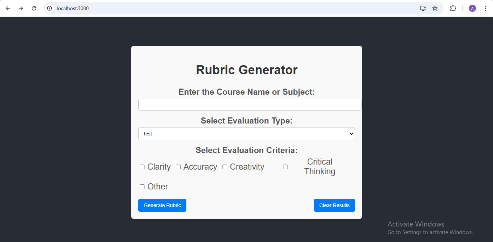
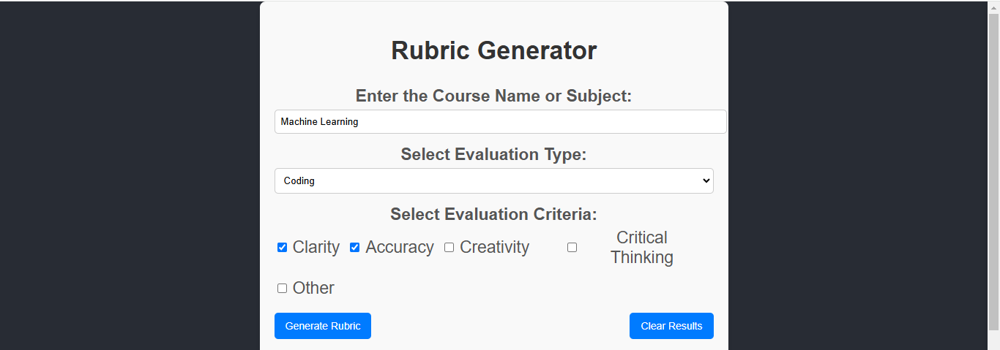
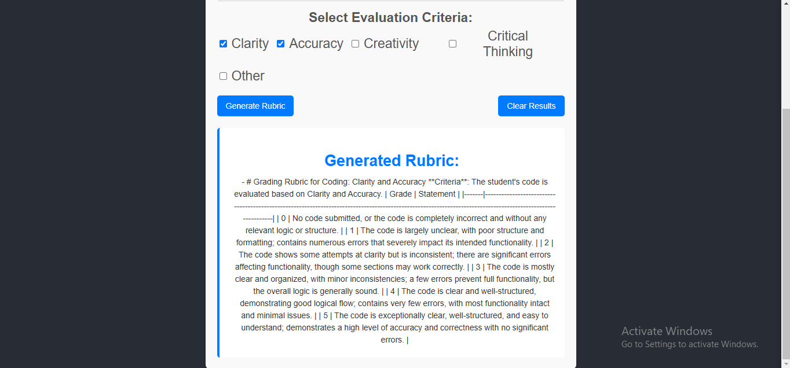
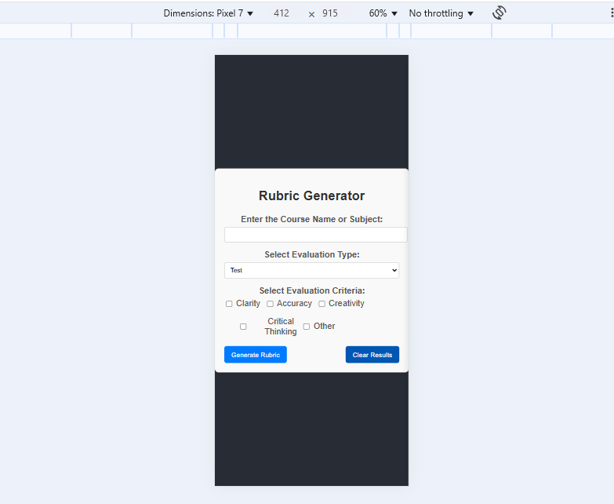

# **Rubric AI**  
AI-powered grading rubric generator for educators. Quickly generate structured grading rubrics for various evaluation types such as **Tests, Coding, Presentations, and Essays** based on selected **evaluation criteria** like **Clarity, Accuracy, Creativity, and Critical Thinking**.

## **Live Demo**
🚀 Coming Soon!

## **Features**  
***
✅ **AI-Powered Rubric Generation** – Generate structured grading rubrics in seconds.  
✅ **Customizable Criteria Selection** – Choose multiple evaluation criteria using checkboxes.  
✅ **Supports Various Assessment Types** – Works for Tests, Coding, Presentations, and Essays.  
✅ **Well-Formatted Output** – Displays rubric in a structured list instead of plain text.  
✅ **Clear & Responsive UI** – Easy-to-use interface with a modern, clean design.  
✅ **Instant API Response** – Powered by OpenAI's GPT for high-quality rubric generation.  

***

### **Screenshots**
📸 **Check out the screenshots below** 👇  

#### **Home Page**

#### **Rubric Generation**
***

#### **Mobile View**
***

#### Getting Started with Create React App

This project was bootstrapped with [Create React App](https://github.com/facebook/create-react-app).

#### Available Scripts

In the project directory, you can run:

#### `npm start`

Runs the app in the development mode.\
Open [http://localhost:3000](http://localhost:3000) to view it in your browser.

The page will reload when you make changes.\
You may also see any lint errors in the console.
